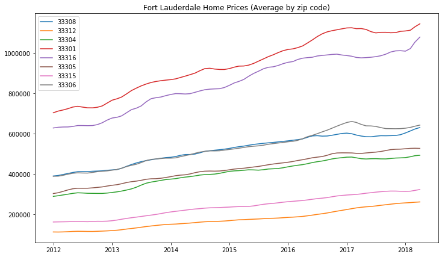
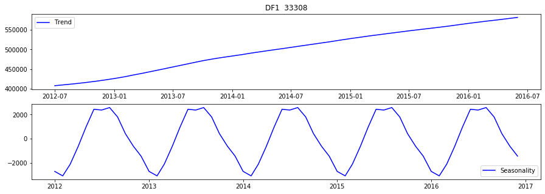
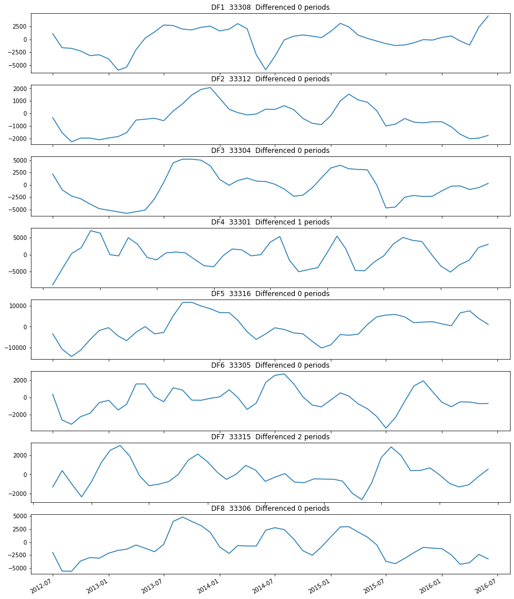
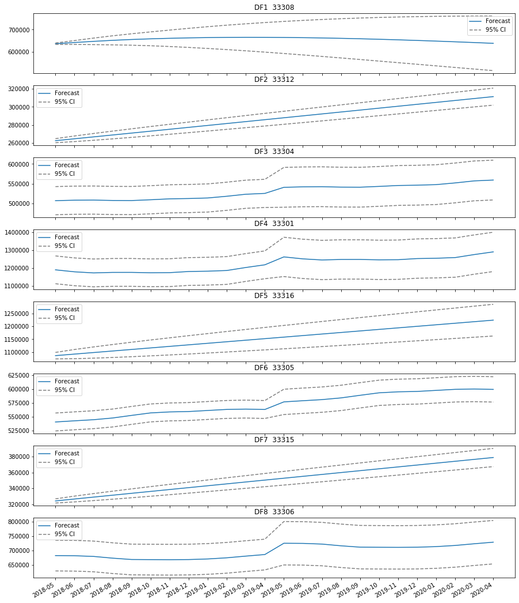
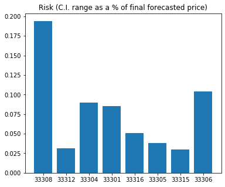
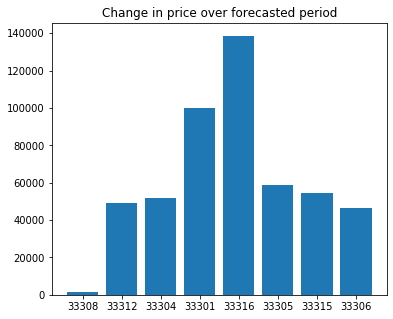
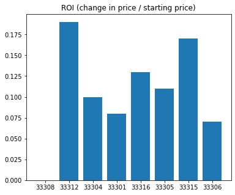

# Time Series Analysis for Home Price Prediction
## Using data from 8 zip codes in the Fort Lauderdale, FL area

**Author**: Kevin Giroux

The contents of this repository detail an analysis of the Module 4 project. This analysis is detailed in hopes of making the work accessible and replicable.


### Introduction and Business problem:

I was hired by my wealthy friend to look into the best locations in and around Fort Lauderdale for her to make an investment in a second home. 

She wants to hold onto the home for 2 years before selling.  Additionally, she asked me to compile several investment choices for her, each with its own justification, and to select an overall winner from this group of top choices.

Primary analysis goals:
- Identify several different metrics or KPI’s on which my friend can make his investment decision.
- Calculate which zip code scores the best for each KPI.
- Quantitatively select an overall winner


### Data
The original dataset consisted of the monthly average home price by zip code for 14,723 American zip codes between January, 1998 and April 2018.

For the purposes of my analysis, I modified the dataset to only include the 8 zip codes comprising the greater Fort Lauderdale, FL area.  I also filtered out all the data from before 2012, as I did not want the effects of the 2008 financial crisis to impact my model's forecasts.

The final dataset included the following zip codes:  33308, 33312, 33304, 33301, 33316, 33305, 33315, and 33306, and includes average monthly prices from 2012-01 through 2018-04.

## Methodology
1. EDA
    - Seasonality decomposition: examining the de-trended time series data to identify any seasonality and to isolate the residuals; all 8 zip codes displayed annual seasonality in pricing
    - Stationarity check of residuals: Dickey-Fuller testing to confirm the stationarity of each zip code's residual time series data; all but 2 zip codes had stationary residuals
    - Differencing of residuals: calculation of optimal differencing period for the 2 zip codes that did not have stationary residuals using the Dickey-Fuller test
    - ACF and PACF analysis: visual examination of plots to determine the appropriate AR and MA orders for each of the zip codes during the ARIMA modeling process
    - Preliminary modeling conclusions: it appeared as though most zip codes could be modeled with first or second order AR models that accounted for annual seasonality
2. Model fitting and tuning
    - Baseline ARIMA model: trained an MA 1 model to establish baseline RMSE scores for each zip code, from which the goal was to improve through manual tuning and the use of auto-ARIMA
    - Manual tuning of ARIMA parameters: used order values determined through visual examiniation of the ACF and PACF plots to re-train each zip code's model and improve upon the baseline RMSE score
    - Auto-ARIMA for final model selection
3. Forecasting and analysis
    - Price prediction for 24 periods into the "future" (2018-05 through 2020-01)
    - Calculation of 95% confidence interval (upper and lower bounds) for each predicted price
    - Visualization of forecasted pricing, by zip code, with confidence intervals overlayed
    - Analysis and calculations to form conclusions

## Results

#### Final time series data

> This chart shows the time series data for each of the 8 zip codes after they had been cleaned and formatted for analysis.

#### Seasonality decomposition

> An example of the core trend and seasonal components for one zip code's time series data.

#### Residuals

> A chart of the stationarized residuals for each zip code, with differencing where necessary.

#### Forecasted prices, by zip code

> Visualization of the future-forecasted average home price for each zip code for the 24 months following the latest period in the provided dataset.

#### Results 1: Least risky zip code

> Calculated by dividing the one-sided confidence interval range by the final forecasted price for each zipcode;  33315 and 33312 were found to be the least risky zip codes to invest in.

#### Results 2: Greatest nominal price increase

> Calculated by subtracting the first-period forecasted price from the last-period forecasted price;  33316 and 33301 showed the greatest nominal increase in price over the two-year forecasting period.

#### Results 3: Return on investment

> Calculated by dividing the change in price over the forecast period by the forecasted price in the first period;  33312 and 33315 displayed the strongest ROIs of all the zip codes examined.


## Conclusions:

1. Which zip code is the least risky to invest in?
    - This was calculated by dividing the one-sided confidence interval range in 2020-01 by each zipcode's forecasted average home price in 2020-01
    - CONCLUSION:  Zip code 33315 is the least risky, with a CI to price ratio of 3.0%
    - CONCLUSION:  Zip code 33312 came in close second, with a CI to price ratio of 3.1%
2. Which zip code will display the greatest overall price increase over the forecast period?
    - This was calculated by subtracting the earliest forecasted price for each zip code (2018-05) from the latest forecasted price for each zip code (2020-01)
    - CONCLUSION:  Homes in zip code 33315 will increase by $138.5k on average over the forecasting period, the most of any of the examined zip codes 
    - CONCLUSION:  Homes in zip code 33301 will increase by $100.1k on average over the forecasting period, making this zip code a close second 
3. Which zip code will deliver the greatest return on investment?
    - This was calculated by dividing the change in average price by zip code over the forecasting period by the earliest forecasted price (2018-05) for each given zip code
    - CONCLUSION: Homes in zip code 33312 will deliver the highest ROI, 19%, over the forecasting period.
    - CONCLUSION: Homes in zip code 33315 will deliver the second-highest ROI, 17%, over the forecasting period.


## Limitations & Next Steps

1. Limitations:  Precision and recall scores were both about equal for both models, with the same strenghths and weaknesses as far as which genres the models were best and worst at classifying.
    - The models were both best at identifying Classical, Metal, and Hip Hop
    - The models were both bad at identifying Blues and Disco
    - These similar results across models could be due to the fact that both models rely on tree-based algorithms

See below for specifics, by model:

Gradient Boosted Trees:
- Recall:  47% of all BLUES tracks were incorrectly classified as either HIP HOP, COUNTRY, or JAZZ
- Precision:  36% of all predicted BLUES tracks were actually either JAZZ or HIP HOP
- Precision:  33% of all predicted DISCO tracks were actually HIP HOP

Random Forest
- Recall:  52% of all BLUES tracks in the dataset were incorrectly classified as either ROCK or HIP HOP
- 65% of all predicted BLUES tracks were actually JAZZ, COUNTRY, HIP HOP, or ROCK
- 38% of all predicted DISCO tracks were actually HIP HOP

2. Next Steps:  
- Expand the dataset to include additional unique examples of Blues and Disco tracks, which were the most difficult for the models to classify correctly.
- Experiment with building a series of models that are trained only on the top 6 most important features identified in this phase of the project.
- Kick off an in-depth genre mapping exercise which will inform the training of future, more sophisticated versions of these models.

### For further information
Please review the narrative of our analysis in [our jupyter notebook](./student.ipynb) or review our [presentation](./presentation_vF.pdf)

For any additional questions, please contact **kevinsgiroux@gmail.com)


##### Repository Structure:

├── README.md                 <- The top-level README for reviewers of this project
├── student.ipynb             <- narrative documentation of analysis in jupyter notebook
├── presentation.pdf          <- pdf version of project presentation
├── data                      <- raw data and column description files
├── images                    <- image files for visualizations included in README document

```
